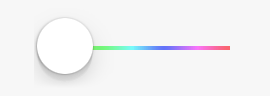

#JMCRainbow
UIKit Method that can be used to generate the rainbow UIImage based on hue Extension to UIView that can be used to generate rainbow background.

### Sample Usage
#### Slider

#### Background

Feel free to use in your projects as long as you keep my contact information.

Copyright  by Janusz Chudzynski

Website:izotx.com

Email: janusz@izotx.com 

Twitter: @appzzman
