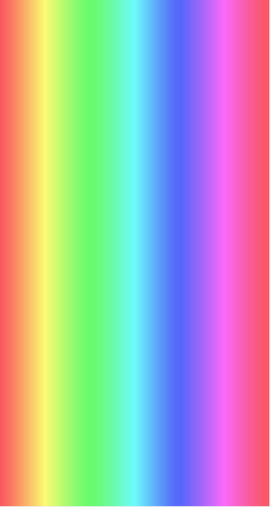

#JMCRainbow
UIKit Method that can be used to generate the rainbow UIImage based on hue Extension to UIView that can be used to generate rainbow background.

### Sample Usage
#### Slider

```Swift
let slider = UISlider(frame: CGRectMake(0, 0, 100, 40))
//slider.rainbowBackground()
let rainbow = UIImage.generateRainbow(CGSizeMake(slider.frame.width, 2), segments: 1000).stretchableImageWithLeftCapWidth(3, topCapHeight: 0)


slider.setMinimumTrackImage(rainbow, forState: UIControlState.Normal)
slider.setMaximumTrackImage(rainbow, forState: UIControlState.Normal)
```


#### Background
```Swift
let v = UIView(frame: CGRectMake(0, 0, 1000, 1000))
v.rainbowBackground()
```



Feel free to use in your projects as long as you keep my contact information.

Copyright  by Janusz Chudzynski

Website:izotx.com

Email: janusz@izotx.com 

Twitter: @appzzman
